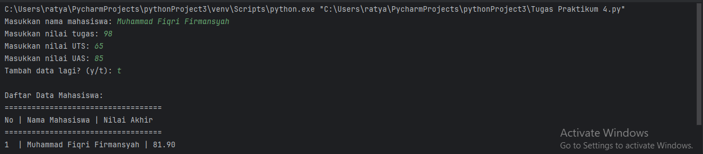

# Pertemuan 9

## Tugas Praktikum

Buat program sederhana untuk menambahkan data kedalam sebuah
list dengan rincian sebagai berikut:
1. Progam meminta memasukkan data sebanyak-banyaknya (gunakan perulangan)
2. Tampilkan pertanyaan untuk menambah data (y/t?), apabila jawaban t (Tidak), maka program akan menampilkan daftar datanya. 
3. Nilai Akhir diambil dari perhitungan 3 komponen nilai (tugas: 30%, uts: 35%, uas: 35%)
4. Buat flowchart dan penjelasan programnya pada README.md.
5. Commit dan Push repository ke Github

```
# Inisialisasi list untuk menyimpan data mahasiswa
data_mahasiswa = []


# Fungsi untuk menghitung nilai akhir
def hitung_nilai_akhir(tugas, uts, uas):
    nilai_akhir = (tugas * 0.3) + (uts * 0.35) + (uas * 0.35)
    return nilai_akhir


# Perulangan untuk memasukkan data
while True:
    # Meminta input data mahasiswa
    nama = input("Masukkan nama mahasiswa: ")
    nim = input("Masukkan NIM mahasiswa: ")
    tugas = float(input("Masukkan nilai tugas: "))
    uts = float(input("Masukkan nilai UTS: "))
    uas = float(input("Masukkan nilai UAS: "))

    # Menghitung nilai akhir
    nilai_akhir = hitung_nilai_akhir(tugas, uts, uas)

    # Menambahkan data ke dalam list
    data_mahasiswa.append({
        'Nama': nama,
        'NIM' : nim,
        'Tugas': tugas,
        'UTS': uts,
        'UAS': uas,
        'Nilai Akhir': nilai_akhir
    })

    # Menanyakan apakah ingin menambahkan data lagi
    tambah_data = input("Tambah data lagi? (y/t): ")
    if tambah_data.lower() != 'y':
        break

# Menampilkan daftar data mahasiswa
print("\nDaftar Data Mahasiswa:")
print("==========================================================================================")
print("No | Nama Mahasiswa                  | NIM           | Tugas |  UTS  |  UAS  | Nilai Akhir")
print("==========================================================================================")
for i, mahasiswa in enumerate(data_mahasiswa, start=1):
    print(f"{i}  | {mahasiswa['Nama']}       | {mahasiswa['NIM']}     | {mahasiswa['Tugas']}  | {mahasiswa['UTS']}  | {mahasiswa['UAS']}  | {mahasiswa['Nilai Akhir']:.2f}")
```

### Hasil Pemogramannya
