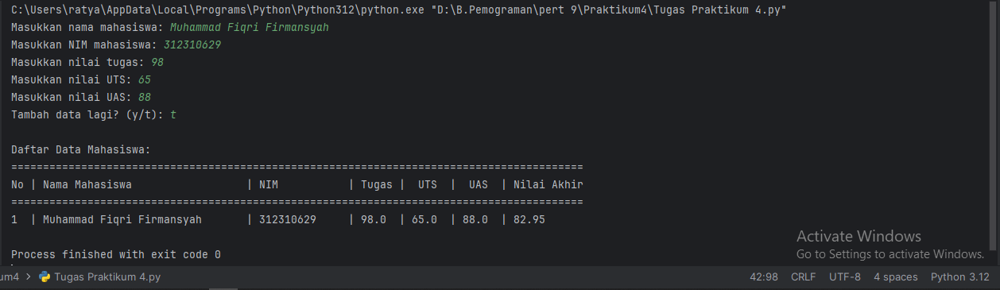

# Pertemuan 9

## Tugas Praktikum

Buat program sederhana untuk menambahkan data kedalam sebuah
list dengan rincian sebagai berikut:
1. Progam meminta memasukkan data sebanyak-banyaknya (gunakan perulangan)
2. Tampilkan pertanyaan untuk menambah data (y/t?), apabila jawaban t (Tidak), maka program akan menampilkan daftar datanya. 
3. Nilai Akhir diambil dari perhitungan 3 komponen nilai (tugas: 30%, uts: 35%, uas: 35%)
4. Buat flowchart dan penjelasan programnya pada README.md.
5. Commit dan Push repository ke Github

```python
# Inisialisasi list untuk menyimpan data mahasiswa
data_mahasiswa = []


# Fungsi untuk menghitung nilai akhir
def hitung_nilai_akhir(tugas, uts, uas):
    nilai_akhir = (tugas * 0.3) + (uts * 0.35) + (uas * 0.35)
    return nilai_akhir


# Perulangan untuk memasukkan data
while True:
    # Meminta input data mahasiswa
    nama = input("Masukkan nama mahasiswa: ")
    nim = input("Masukkan NIM mahasiswa: ")
    tugas = float(input("Masukkan nilai tugas: "))
    uts = float(input("Masukkan nilai UTS: "))
    uas = float(input("Masukkan nilai UAS: "))

    # Menghitung nilai akhir
    nilai_akhir = hitung_nilai_akhir(tugas, uts, uas)

    # Menambahkan data ke dalam list
    data_mahasiswa.append({
        'Nama': nama,
        'NIM' : nim,
        'Tugas': tugas,
        'UTS': uts,
        'UAS': uas,
        'Nilai Akhir': nilai_akhir
    })

    # Menanyakan apakah ingin menambahkan data lagi
    tambah_data = input("Tambah data lagi? (y/t): ")
    if tambah_data.lower() != 'y':
        break

# Menampilkan daftar data mahasiswa
print("\nDaftar Data Mahasiswa:")
print("==========================================================================================")
print("No | Nama Mahasiswa                  | NIM           | Tugas |  UTS  |  UAS  | Nilai Akhir")
print("==========================================================================================")
for i, mahasiswa in enumerate(data_mahasiswa, start=1):
    print(f"{i}  | {mahasiswa['Nama']}       | {mahasiswa['NIM']}     | {mahasiswa['Tugas']}  | {mahasiswa['UTS']}  | {mahasiswa['UAS']}  | {mahasiswa['Nilai Akhir']:.2f}")
```

### Hasil Pemogramannya


## Latihan

### Akses List
- tampilkan elemen ke 3
- ambil nilai elemen ke 2 sampai elemen ke 4
- ambil elemen terakhir

```python
# Membuat list dengan 5 elemen
my_list = [22, 23, 24, 25, 26]

# Mengakses dan menampilkan elemen ke-3
elemen_ke_3 = my_list[2]
print("Elemen ke-3:", elemen_ke_3)

# Mengambil nilai elemen ke-2 sampai elemen ke-4
nilai_elemen_2_ke_4 = my_list[1:4]
print("Nilai elemen ke-2 sampai elemen ke-4:", nilai_elemen_2_ke_4)

# Mengambil elemen terakhir
elemen_terakhir = my_list[-1]
print("Elemen terakhir:", elemen_terakhir)
```
#### Hasil Programnya


### Mengubah Elemen List
- ubah elemen ke 4 dengan nilai lainnya
- ubah elemen ke 4 sampai dengan elemen terakhir

```python
# Membuat list dengan 5 elemen
my_list = [22, 23, 24, 25, 26]

# Ubah elemen ke-4 dengan nilai lainnya
my_list[3] = 45

# Ubah elemen ke-4 sampai dengan elemen terakhir
my_list[3:] = [31, 32, 33]

# Menampilkan list setelah perubahan
print("List setelah perubahan:", my_list)
```
#### Hasil Programnya


### Menambah Elemen List
- ambil 2 bagian dari list pertama (A) dan jadikan list ke 2 (B)
- tambah list B dengan nilai string
- tambah list B dengan 3 nilai
- gabungkan list B dengan list A

```python
# Membuat list dengan 5 elemen
my_list = [22, 23, 24, 25, 26]

# Ambil 2 bagian dari list pertama (A) dan jadikan list ke-2 (B)
list_A = my_list[:2]
list_B = list_A.copy()

# Tambahkan list B dengan nilai string
list_B.append("Hello")

# Tambahkan list B dengan 3 nilai
list_B.extend([1, 2, 3])

# Gabungkan list B dengan list A
list_A_and_B = list_B + list_A

# Menampilkan hasil akhir
print("List A setelah perubahan:", list_A)
print("List B setelah perubahan:", list_B)
print("Hasil gabungan list B dan A:", list_A_and_B)
```

#### Hasil Programnya


